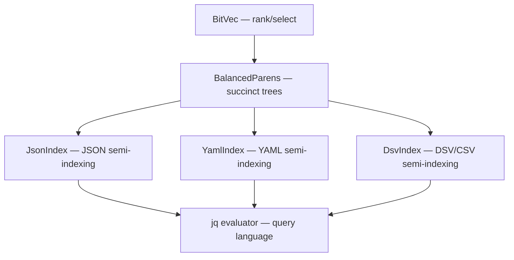

# Succinctly Knowledge Map

This page maps the concepts, data structures, and algorithms in succinctly and how they relate to each other. For audience-oriented navigation, see the [documentation hub](README.md).

## Core Data Structures

The library is built on three foundational data structures that compose together:

| Concept                    | Wiki Page                                | Implementation                            | Architecture Doc                                                   |
|----------------------------|------------------------------------------|-------------------------------------------|--------------------------------------------------------------------|
| Bitvector with rank/select | [BitVec](architecture/bitvec.md)                      | [src/bits/](../src/bits/)                 | [architecture/bitvec.md](architecture/bitvec.md)                   |
| Succinct tree encoding     | [BalancedParens](architecture/balanced-parens.md)     | [src/trees/bp.rs](../src/trees/bp.rs)     | [architecture/balanced-parens.md](architecture/balanced-parens.md) |
| JSON structural index      | [JsonIndex](parsing/json-index.md)               | [src/json/](../src/json/)                 | [parsing/json.md](parsing/json.md)                                 |
| YAML structural index      | [YamlIndex](parsing/yaml-index.md)               | [src/yaml/](../src/yaml/)                 | [parsing/yaml.md](parsing/yaml.md)                                 |
| DSV/CSV structural index   | [DsvIndex](parsing/dsv-index.md)                 | [src/dsv/](../src/dsv/)                   | [parsing/dsv.md](parsing/dsv.md)                                   |
| Query language             | [jq Evaluator](reference/jq-evaluator.md)          | [src/jq/](../src/jq/)                     | [CLAUDE.md](../CLAUDE.md#jq-format-functions)                      |
| SIMD acceleration          | [SIMD Strategy](optimizations/simd-strategy.md)        | per-module `simd/` dirs                   | [optimizations/simd.md](optimizations/simd.md)                     |

## How Semi-Indexing Works

Semi-indexing is the unifying architectural idea. Instead of building a DOM tree, succinctly builds a lightweight structural index and extracts values lazily:

1. **Scan** — SIMD-accelerated pass identifies structural characters (braces, brackets, quotes, newlines)
2. **Encode** — Structural characters become a [BalancedParens](architecture/balanced-parens.md) bitvector, with additional "interest bit" vectors
3. **Navigate** — O(1) tree operations (parent, child, sibling) via rank/select on the BP bitvector
4. **Extract** — Values are parsed only when accessed by a query

This yields 3-6% memory overhead vs 100%+ for DOM parsers. See [architecture/semi-indexing.md](architecture/semi-indexing.md) for the full design.

## Academic Foundations

Each core data structure traces back to specific research papers:

| Paper                                                                                                     | Authors                  | Year | Used By                                                    |
|-----------------------------------------------------------------------------------------------------------|--------------------------|------|------------------------------------------------------------|
| [Broadword Implementation of Rank/Select Queries](https://vigna.di.unimi.it/ftp/papers/Broadword.pdf)     | Vigna                    | 2008 | [BitVec](architecture/bitvec.md) — broadword algorithms                 |
| [Space-Efficient, High-Performance Rank & Select](https://www.cs.cmu.edu/~dga/papers/zhou-sea2013.pdf)    | Zhou, Andersen, Kaminsky | 2013 | [BitVec](architecture/bitvec.md) — Poppy 3-level directory              |
| [Fully-Functional Succinct Trees](https://doi.org/10.1137/1.9781611973075.18)                             | Sadakane & Navarro       | 2010 | [BalancedParens](architecture/balanced-parens.md) — RangeMin navigation |
| Optimal Succinctness for Parentheses                                                                      | Navarro & Sadakane       | 2014 | [BalancedParens](architecture/balanced-parens.md) — space-optimal BP    |
| [Parsing Gigabytes of JSON per Second](https://arxiv.org/abs/1902.08318)                                  | Langdale & Lemire        | 2019 | [JsonIndex](parsing/json-index.md) — SIMD structural scanning      |
| [Data-Parallel Finite-State Machines](https://doi.org/10.1145/2597917.2597946)                            | Mytkowicz et al.         | 2014 | [JsonIndex](parsing/json-index.md) — PFSM parser                   |
| [Faster Population Counts Using AVX2](https://arxiv.org/abs/1611.07612)                                   | Mula, Kurz, Lemire       | 2016 | [BitVec](architecture/bitvec.md) — Harley-Seal popcount                 |
| [Semi-Indexing Semi-Structured Data in Tiny Space](https://arxiv.org/abs/1104.4892)                       | Ottaviano et al.         | 2011 | Overall architecture                                       |

See [architecture/prior-art.md](architecture/prior-art.md) for the complete reference list, including the Haskell-Works heritage, general references (Knuth, Warren, Drepper), and related projects (simdjson, simd-json, sonic-rs).

## SIMD Platform Support

Succinctly uses runtime CPU detection to select the best SIMD path:

| Platform | Extensions Used            | Modules         |
|----------|----------------------------|-----------------|
| x86_64   | AVX2, BMI2, SSE4.2, SSE2   | JSON, DSV, YAML |
| ARM64    | NEON, PMULL, SVE2-BITPERM  | JSON, DSV, YAML |
| Fallback | Broadword / scalar         | All modules     |

See [SIMD Strategy](optimizations/simd-strategy.md) for details on per-module SIMD usage and lessons learned (including why AVX-512 was rejected).

## Performance at a Glance

| Format | vs Competitor | Speed            | Memory      |
|--------|---------------|------------------|-------------|
| JSON   | vs jq         | 1.0-2.5x faster  | 5-25x less  |
| YAML   | vs yq         | 1.7-10.6x faster | 4-25x less  |
| JSON   | vs serde_json | 3-5x faster      | 18-46x less |

Full data: [benchmarks/](benchmarks/)

## Key Cross-References

- **BitVec → BalancedParens**: BP stores its parenthesis sequence as a `BitVec`, using rank1/select1 for O(1) tree navigation. See [architecture/core-concepts.md](architecture/core-concepts.md).
- **BalancedParens → JsonIndex/YamlIndex**: Each semi-index builds a BP encoding of the document's nesting structure. The BP's `find_close()` operation enables skipping entire subtrees.
- **Interest Bits → Cursor API**: Additional bitvectors (string positions, array elements, object keys) enable the cursor to distinguish node types without re-parsing.
- **jq Evaluator → Document trait**: The evaluator is generic over `Document`, allowing it to work with both `JsonIndex` and `YamlIndex` through a shared cursor interface. See [jq Evaluator](reference/jq-evaluator.md).
- **SIMD → Parsing**: Each format module has a `simd/` subdirectory with platform-specific implementations that are selected at runtime via `#[cfg(target_arch)]` and CPU feature detection.

## Optimization History

The project documents both successes and failures in optimization:

- [optimizations/](optimizations/) — 11 technique guides (SIMD, cache, bit manipulation, etc.)
- [parsing/yaml.md](parsing/yaml.md) — Detailed P0-P12 + O1-O3 optimization journey with benchmarks
- [optimizations/history.md](optimizations/history.md) — Why AVX-512 was removed, and other lessons

Key lesson: Micro-benchmark wins often don't translate to end-to-end improvements. Three consecutive YAML optimizations (P2.6, P2.8, P3) showed micro-benchmark gains but caused real-world regressions.

## Maintaining the Knowledge Map

Maintenance procedures are codified in the `knowledge-map` skill (`.claude/skills/knowledge-map/SKILL.md`), which Claude auto-invokes when updating wiki pages. The key rules:

- Every concept page follows a consistent structure: breadcrumb, What It Does, How It Works, Depends On, Used By, Academic Papers, Source & Docs
- Depends On / Used By links must be bidirectional
- Tables use fixed-width columns
- Changes are logged in [log.md](log.md)

## Ingestion Log

See [log.md](log.md) for a record of wiki updates.
