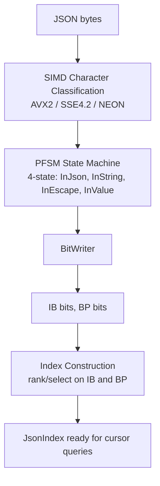

# JsonIndex

[Knowledge Map](index.md) > JsonIndex

Semi-index for JSON documents. Builds a lightweight structural index (~3-4% overhead) enabling O(1) navigation without constructing a DOM tree.

## What It Does

`JsonIndex` scans a JSON document once, producing:

| Component                  | Purpose                          | Size           |
|----------------------------|----------------------------------|----------------|
| Interest Bits (IB)         | Mark structural byte positions   | ~0.5% of input |
| Balanced Parentheses (BP)  | Encode tree structure            | ~0.5% of input |
| Rank/Select indices        | Enable O(1) queries on IB and BP | ~2-3% of input |

After indexing, a cursor API navigates the document structure in O(1) per step, extracting values lazily only when accessed.

## Parsing Pipeline



### PFSM (Parallel Finite-State Machine)

The parser uses precomputed 256-entry lookup tables that pack all 4 state transitions into a single `u32`. Each byte lookup produces the next state and output bits in one table access. This is **40-77% faster** than scalar parsing.

Based on [Mytkowicz et al. 2014](https://dl.acm.org/doi/10.1145/2597917.2597946) (Data-Parallel Finite-State Machines).

### SIMD Character Classification

Before the state machine runs, SIMD identifies structural characters in parallel:

| Platform | Width              | Throughput                             |
|----------|--------------------|----------------------------------------|
| AVX2     | 32 bytes/iteration | ~880 MiB/s                             |
| SSE4.2   | 16 bytes/iteration | —                                      |
| NEON     | 16 bytes/iteration | —                                      |
| BMI2     | Bit manipulation   | Used for PDEP/PEXT in post-processing  |

Based on [simdjson](https://arxiv.org/abs/1902.08318) (Langdale & Lemire 2019).

## Interest Bits and BP Encoding

```
JSON:  {"name":"Alice","age":30}
IB:    1 1     1       1    1
       {  "     "       "    3

BP:    1 10   10     10   10  0
       { key  value  key  value }
```

Navigation maps between BP positions and text positions via rank/select:
- Text position → BP position: `rank1` on IB
- BP position → text position: `select1` on IB

## Cursor API

```rust
let index = JsonIndex::build(json_bytes);
let cursor = index.root(json_bytes);

// Navigate without parsing values
let first_child = cursor.first_child();
let next = first_child.next_sibling();

// Extract value only when needed
let name: &str = cursor.as_str();
```

## Validation

`JsonIndex` performs minimal validation during indexing (structural characters only). For strict RFC 8259 validation, use `--validate` flag or the `json validate` subcommand.

## Depends On

- [BitVec](bitvec.md) — IB and BP are stored as bitvectors with rank/select indices
- [BalancedParens](balanced-parens.md) — BP encoding with `find_close` for subtree skipping

## Used By

- [jq Evaluator](jq-evaluator.md) — evaluates jq expressions against the cursor API

## Academic Papers

- [Langdale & Lemire 2019](https://arxiv.org/abs/1902.08318) — simdjson, SIMD structural scanning
- Mytkowicz et al. 2014 — PFSM for parallel state machine execution
- [Ottaviano et al. 2011](https://arxiv.org/abs/1104.4892) — semi-indexing semi-structured data

## Source & Docs

- Implementation: [src/json/](../src/json/) (mod.rs, pfsm_optimized.rs, bit_writer.rs, validate.rs)
- SIMD variants: [src/json/simd/](../src/json/simd/) (avx2.rs, sse42.rs, neon.rs, bmi2.rs, sve2.rs)
- Parsing doc: [parsing/json.md](parsing/json.md)
- Benchmark: [benchmarks/jq.md](benchmarks/jq.md), [benchmarks/rust-parsers.md](benchmarks/rust-parsers.md)
