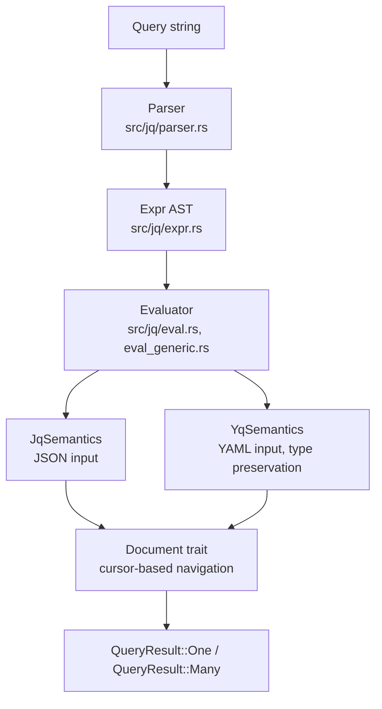

# jq Evaluator

[Home](../../) > [Docs](../) > [Reference](./) > jq Evaluator

A jq-compatible query language implementation that works with succinctly's semi-indexed documents, supporting both JSON and YAML inputs.

## What It Does

The jq module provides `parse()` and `eval()` functions that execute jq expressions against semi-indexed documents without building a DOM:

```rust
use succinctly::jq::{parse, eval, JqSemantics, QueryResult};
use succinctly::json::{JsonIndex, StandardJson};

let json = br#"{"users": [{"name": "Alice"}, {"name": "Bob"}]}"#;
let index = JsonIndex::build(json);
let cursor = index.root(json);

let expr = parse(".users[].name").unwrap();
let result = eval::<Vec<u64>, JqSemantics>(&expr, cursor);
```

## Architecture



### Generic over Document

The evaluator is generic over a `Document` trait, which is implemented by both `JsonIndex` and `YamlIndex` cursors. This means the same jq expression AST works for both JSON and YAML inputs.

### Evaluation Semantics

| Mode           | Used By      | Behavior                                            |
|----------------|--------------|-----------------------------------------------------|
| `JqSemantics`  | `sjq` (JSON) | Standard jq behavior                                |
| `YqSemantics`  | `syq` (YAML) | Preserves YAML types (quoted strings stay strings)  |

### Streaming

For large outputs, the evaluator supports streaming via `StreamableValue`, writing results incrementally without buffering the entire output. The YAML identity query (`yq '.'`) uses direct cursor-to-JSON streaming (P9 optimization).

## Supported Syntax

The implementation covers a substantial subset of jq:

- **Navigation**: `.field`, `.[n]`, `.[]`, `.[n:m]`, `..` (recursive descent)
- **Construction**: `[expr]` (arrays), `{key: expr}` (objects)
- **Operators**: arithmetic (`+`, `-`, `*`, `/`, `%`), comparison, boolean (`and`, `or`, `not`), alternative (`//`)
- **Assignment**: `=`, `|=`, `+=`, `-=`, `*=`, `/=`, `%=`, `//=`, `del()`
- **Control flow**: `if-then-else-end`, `try-catch`, pipes (`|`), comma (multiple outputs)
- **Builtins**: `length`, `keys`, `values`, `has()`, `in()`, `map()`, `select()`, `empty`, `range()`, `limit()`, `first()`, `last()`, `type`, `tostring`, `tonumber`, `ascii_downcase`, `ascii_upcase`, `split()`, `join()`, `test()`, `match()`, `capture()`, `gsub()`, `sub()`, `ltrimstr()`, `rtrimstr()`, `startswith()`, `endswith()`, `contains()`, `inside()`, `indices()`, `sort_by()`, `group_by()`, `unique_by()`, `min_by()`, `max_by()`, `flatten`, `transpose`, `to_entries`, `from_entries`, `with_entries`, `paths`, `getpath`, `setpath`, `delpaths`, `leaf_paths`, `env`, `input`, `inputs`, `debug`, `halt`, `halt_error`, `def-;` (function definitions), `label-break`, `foreach`, `reduce`, `$__loc__`, `@format` strings
- **Format functions**: `@csv`, `@tsv`, `@dsv(delim)`, `@json`, `@text`, `@uri`, `@base64`, `@base64d`, `@html`, `@sh`, `@yaml`, `@props`
- **Position navigation** (succinctly extension): `at_offset(n)`, `at_position(line; col)`

## Depends On

- [JsonIndex](../parsing/json-index.md) — cursor API for JSON documents
- [YamlIndex](../parsing/yaml-index.md) — cursor API for YAML documents
- [DsvIndex](../parsing/dsv-index.md) — via `--input-dsv` flag

## Source & Docs

- Implementation: [src/jq/](../../src/jq/) (parser.rs, expr.rs, eval.rs, eval_generic.rs, value.rs, stream.rs, lazy.rs, document.rs)
- CLI integration: [src/bin/succinctly/jq_runner.rs](../../src/bin/succinctly/jq_runner.rs), [src/bin/succinctly/yq_runner.rs](../../src/bin/succinctly/yq_runner.rs)
- CLI guide: [guides/cli.md](../guides/cli.md)
